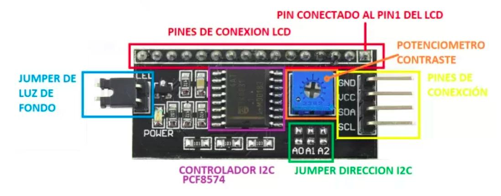
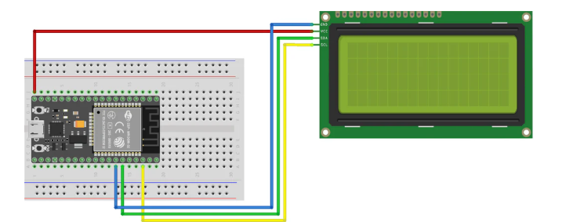

# Proyecto: Ejemplo de uso de LCD 1602 con I2C en ESP32

Este proyecto muestra un ejemplo básico de cómo utilizar un display LCD 1602 con interfaz I2C utilizando una placa ESP32. El mensaje "Hello, From" y "ESP32 I2C LCD1602" se muestra en la pantalla en dos líneas.

## Requisitos

- Placa ESP32  
- Módulo LCD 1602 con interfaz I2C (por ejemplo, con el chip PCF8574)  
- Arduino IDE  
- Librerías:  
  - `Wire.h`  
  - `LiquidCrystal_I2C.h`  

## Instalación de librerías

Desde el **Gestor de Librerías** en el Arduino IDE, busca e instala:

- `LiquidCrystal I2C` de Marco Schwartz (u otra compatible)
- `Wire` (viene incluida con el entorno)

## Dirección I2C

Este ejemplo usa la dirección I2C `0x27`, que es común para muchos módulos. Si tu módulo tiene otra dirección, deberás modificar esta línea:

```cpp
LiquidCrystal_I2C lcd(0x27, 16, 2);
```

### Nota

Para que este ejemplo funcione correctamente, es necesario que el LCD 1602 cuente con una interfaz I2C basada en el chip **PCF8574** o compatible. Esta interfaz permite la comunicación mediante los pines SDA y SCL, simplificando el cableado y reduciendo el uso de pines del microcontrolador.

<p align="center">
  
</p>


### Conexión del Circuito

En este ejemplo, se utilizan los pines 21 (SDA) y 22 (SCL) del ESP32 para establecer la comunicación con el display. Ten en cuenta que la ubicación física de estos pines puede variar según el modelo de placa ESP32 que estés utilizando.

<p align="center">
  
</p>
