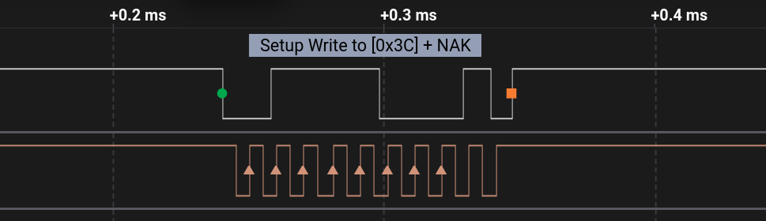

## Práctica de comunicación I2C con Arduino y ESP32

En este ejemplo intento enviar un buffer de datos a un dispositivo con dirección `0x3C`.  
Como el dispositivo **no existe** y solo tengo el microcontrolador conectado al **analizador lógico**,  
la comunicación **nunca pasa de la petición de escritura a la dirección del esclavo `0x3C`**,  
y el bus finaliza con un **NAK (No Acknowledge)**.

  

